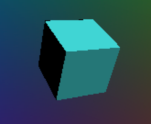
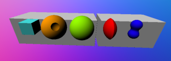

# Ray-Marching SDFs 

By J. Reuben Wetherbee
University of Pennsylvania
Computer Graphics and Game Technology Masters Program
CIS 566 Spring 2019

## Overview
The purpose of this project was to create procedurally generated terrain using Signed Distance Functions (SDFs)
and then use ray marching to render these objects. 
Demo can be viewed [in github pages](https://jrweth.github.io/hw02-raymarching-sdfs/)

## Basic Setup (non shader code)
- A movable camera 
- Set up of uniform parameters and shader program
- A square that spans the range [-1, 1] in X and Y that is rendered as the
"background" of the scene

## Starting Point - ray marching 
Almost the entirety of the code was implemented in the fragment shader.
The first necessary step was to create a ray marching algorithm which
would cycle through the objects and find the distance from the camera
using ray marching.  This was made easier by create a data structure
which could hold all the parameters for each object so that they could
be iterated through.
```
struct sdfParams {
       int sdfType;    //defines type (e.g. sphere, cube etc)
       int textureType;   //defines the texture
       vec3 center;
       float radius;
       vec3 color;
       int intExtra1;  // for additional int parameters
       vec3 vec3Extra1;  // for additional float parameters
   };
   ```
### Basic SDFs
Many of the following concepts were taken from the website of [Inigo Quilez](http://www.iquilezles.org/index.html)

Once the ray marching algorithm was finished a simple sphere sdf was developed:
```$xslt
float sphereSDF(sdfParams params, vec3 point) {
    return length(point - params.center) - params.radius;
}
```


To test various composition functions, the sphere was combined with a second sphere 
to demonstrate the following:
### Subtraction
```$xslt
float sdfSubtract(float distance1, float distance2) {
    return max ( -1.0 * distance1, distance2);
}
```


### Intersection
```$xslt
float sdfIntersect(float distance1, float distance2) {
    return max ( distance1, distance2 );
}
```


### Smooth Blend
```$xslt
float sdfSmoothBlend(float a, float b) {
    float k = 0.7;
    float h = clamp( 0.5+0.5*(b-a)/k, 0.0, 1.0 );
    return mix( b, a, h ) - k*h*(1.0-h);
}
```


### Cube
Other SDFs were also created. Especially necessary was the cube
in order to implement Bounding Volumes.
```$xslt

float cubeSDF(sdfParams params, vec3 point) {
     //translate points so that cube is at origin
     point -= params.center;
     vec3 d = abs(point) - params.size/2.0;
     return length(max(d, 0.0))
        + min(max(d.x,max(d.y,d.z)),0.0);
}
```


### Moon
These basic shapes could then be combined in various ways such
as in the case of the moon where random spheres were subtracted
from the main sphere


## Computing Normals

For some of the shapes (such as the sphere) computing the surface normal was trivial.
In other cases the normal was computed by sampling using 4 rays surrounding
the current ray (two on horizontal axis, two on the vertical) to
calculate the normal at the point.

## Bounding Value Hierarchy
To improve efficiency, a bounding volume heirarchy was developed so that
each ray does not need to be tested against each object if the bounding
volume in which it resides was not intersected by the ray.  

This was accomplished by using 4 levels of heirarchy.
- The first level includes a cube which encompasses all the objects in 
the scene. It is calculated by finding or approximating the min 
and max for each object on the x,y and z axis  and taking the min of the mins 
and the max of the maxes for the overall bounding volume.

- Second level divided the scene space into 8 sections corresponding to
the 8 octaves divided by the x, y and z planes and the outer limits of the scene

- The third level divided these 8 octaves in half along the x,z and z planes 
to get up to 64 new volumes

- The fourth level contained the bounding volumes for each individual element

Althougth the BVH heirarchy was implemented, because the number of objects
was low enough the overhead of creating the BVH outweighed the 
efficiencies it created, so in the final implementation the BVH was removed.

## Final Scene
The final scene was created by using the various SDFs and composition functions
to create planetary scene.  
- The planets were rotated using sine/cosine functions.
- The background was generated using random values for star positions
- Shading was done using normal positions
- The double sun shading was done using Fractal Brownian Motion
